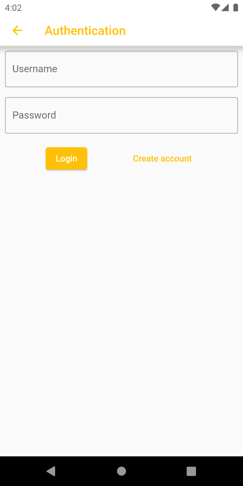

## CashControl

Ihr digitaler Einkaufsassistent

Mit CashControl lassen sich Einkaufslisten erstellen, 
Kassenbons einscannen um herauszufinden, ob man in der Eile etwas vergessen hat
oder wieder etwas extra gekauft hat, obwohl man knapp bei Kasse ist.  
Die Einkaufslisten können entweder lokal angelegt werden, oder in einem Team,
sodass alle Familienmitglieder oder WG Mitbewohner die Liste gemeinsam nutzen können.

### Funktionen:  
[Einkaufslisten erstellen](#einkaufslisten-erstellen)  
[Scannen von Kassenbons](#scannen-von-kassenbons)  
[Kollaborativen Bereich erstellen](#kollaborativen-bereich-erstellen)  

### Einkaufslisten erstellen
Beim Starten der Applikation sieht man eine Liste an Einkaufslisten.
Beim ersten Start befindet man sich im lokalen Arbeitsbereich.
Mit dem Plus lassen sich neue Listen erstellen.

*Startansicht der App mit erstellten Listen*

Wenn eine Liste erstellt wird, kann eine Kategorie erstellt werden,
durch die die Ausgaben bei der Analyse in verschiedene Bereiche unterteilt werden können.

*Erstellen einer neuen Liste*

Wählt man eine Liste aus, so sieht man die einzelnen Produkte, die auf der
Einkaufsliste stehen. Mit dem Plus können weitere Produkte zur Einkaufsliste hinzugefügt werden.
Mit der Kamera können zur Einkaufsliste Kassenbons gescannt werden.

*Ansicht einer Einkaufsliste*

Wenn ein Produkt zur Liste hinzugefügt wird, können Name, Anzahl und Einheit eingefügt werden,
wobei der Name genügt. Als Standardanzahl wird 1 angenommen.

*Hinzufügen eines Produkts zur Einkaufsliste*

### Scannen von Kassenbons

Wenn ein Kassenbon gescannt werden soll, muss zuerst ein Foto des Bons gemacht werden.

*Kameraansicht*

Ist das Foto gemacht worden, muss das Bild auf den Text des Bons zugeschnitten werden, um ein präzises Ergebnis der KI
zu gewährleisten.

*Zuschneiden des Bildes*

Wenn das Zuschneiden beendet ist, wird das Scannen über den Haken gestartet.
Die Ergebnisse werden in Form einer Liste angezeigt. In Grün werden
alle gefundenen Produkte mit ihrem Preis aufgelistet. In Rot werden alle 
Produkte aufgelistet, die auf der Einkaufsliste stehen, jedoch nicht auf dem 
Kassenbon zu finden sind. In Gelb werden alle Produkte aufgelistet, die auf dem
Kassenbon gefunden wurden, die jedoch nicht auf der Einkaufsliste stehen.  
Da die Produkte auf dem Kassenbon oft nicht denselben Namen haben, wie die 
Namen, die man auf die Einkaufsliste schreibt (Bspw.: "Katzenfutter" auf der Einkaufsliste
 und "K.XXL.Katzennahr." auf dem Kassenbon), kann es vorkommen, dass Produkte
fälschlicherweise als Extra Produkte aufgelistet werden und das Produkt auf der
Einkaufsliste als Fehlend eingetragen wird, obwohl es gekauft wurde.  
Deshalb gibt es die Möglichkeit ein Extra Produkt einem Fehlenden oder Gefundenen Produkt zuzuweisen.
Wird "Katzenfutter" nun auf einer anderen Liste angelegt, so wird das Produkt 
beim Scannen auch automatisch gefunden, wenn auf dem Kassenbon nur "K.XXL.Katzennahr." steht.

*Ergebnisse eines Scans*

### Kollaborativen Bereich erstellen
Wenn man mit der Familie oder WG Mitbewohnern eine gemeinsame Liste verwenden möchte,
ist dies über ein Team möglich. Um ein Team anzulegen, muss in der Startansicht
über die drei horizontalen Striche das Menü ausgeklappt werden. Dort werden
alle Teams gelistet, in denen man als Nutzer ist. Standardmäßig ist dort das 
lokale Team ausgewählt.

*Menüansicht*

Wenn man die Kollaborativen Funktionalitäten nutzen möchte, muss man sich als Nutzer anmelden. 
Dies ist über den Login-Button am unteren Ende des Ausklappmenüs.

*Login/Registrierungsansicht*

Wenn man Teams erstellen möchte, muss man im Menü "Manage teams" auswählen. 
Dort gelangt man zur Übersicht über alle Teams, in denen man Mitglied ist.
Mit dem Plus kann ein neues Team angelegt werden. Bei der Erstellung muss
dem Team ein Name gegeben werden.

*Überblick über die Teams*

Wenn man ein Team anwählt, sieht man alle Mitglieder des Teams (ausgenommen man selbst).
Mit einem langen Klick auf ein Teammitglied kann man eine Schaltfläche zum entfernen des 
Teammitglieds aufrufen. Mit dem Plus können weitere Teammitglieder ins Team hinzugefügt werden.
Das Hinzufügen funktioniert über den Scan eines QR-Codes oder die Eingabe eines Zahlencodes.

*QR-Code eines Teams zum Beitreten. Über den Button "Share" kann ein Zahlencode angezeigt werden.*

*Zahlencode des Teams*

Um den QR-Code zu scannen oder den Zahlencode einzugeben, um einem Team beizutreten,
muss man im seitlichen Menü "Join team" auswählen. Dies öffnet ein Fenster
in dem der QR-Code scanner oder ein Textfeld ausgewählt werden können.

*Ansicht um einem Team beizutreten*

Wenn Listen in einem Team angelegt werden, sind diese für alle Teammitglieder sichtbar
und alle Teammitglieder können die Listen bearbeiten und Scans durchführen.
Wenn Änderungen (z.B. ein Scan) erfolgen, während man nicht mit dem Server
verbunden ist, werden die Änderungen nachträglich synchronisiert.